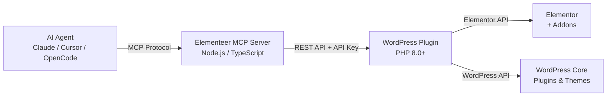

---
hide:
  - toc
---

# The agent-native Elementor growth layer.

Elementeer connects AI agents to Elementor, giving you operational superpowers — from template management to full site orchestration, through the Model Context Protocol (MCP).

-   :material-rocket-launch:{ .lg .middle } __Get Started in 5 Minutes__

    ---

    Install the WordPress plugin and MCP server, generate an API key, and run your first command.

    [:octicons-arrow-right-24: Quickstart](use/quickstart.md)

-   :material-puzzle:{ .lg .middle } __128+ Free Tools__

    ---

    Templates, pages, media, SEO, navigation, assessment, performance, and more. All free. All agent-native.

    [:octicons-arrow-right-24: Tool Reference](reference/mcp-tools.md)

-   :material-shield-check:{ .lg .middle } __Safe by Design__

    ---

    L0-L3 governance model with fine-grained API key capabilities. Reads are instant, writes are intentional.

    [:octicons-arrow-right-24: Governance](use/concepts-governance.md)

-   :material-storefront:{ .lg .middle } __Elementor-Ecosystem First__

    ---

    WooCommerce, Voxel Marketplace, booking systems, LMS platforms, accessibility — integrations for the tools you already use.

    [:octicons-arrow-right-24: Integrations](use/index.md#integrations)

-   :material-robot:{ .lg .middle } __Agent-Native Protocol__

    ---

    Works with Claude, Cursor, OpenCode, Antigravity, and Codex. One protocol, all agents.

    [:octicons-arrow-right-24: Agent Setup](use/agents/claude.md)

-   :material-download:{ .lg .middle } __Free. Always.__

    ---

    No site limits. No trial periods. The free tier delivers real value. Advanced features unlock optional power.

    [:octicons-arrow-right-24: Product Tiers](use/concepts-tiers.md)

---

## Who is Elementeer for?

### :material-account-tie: Freelancers & Solopreneurs

Ship Elementor sites faster. Let your AI agent handle template management, global style updates, brand setup, and SEO while you focus on clients.

### :material-office-building: Agencies

Orchestrate multiple sites, enforce brand consistency, and give your team agent-native superpowers. From site assessment to theme builder wizards.

### :material-developer-board: Developers & MCP Enthusiasts

Elementeer is Apache-2.0 licensed and fully extensible. Build addons, register capabilities, and create agent tools that multiply what Elementor can do.

---

## How it works

1. **Install** the WordPress plugin on your site and the MCP server on your machine.
2. **Generate** an API key with the capabilities you need.
3. **Connect** your AI agent to Elementeer via the MCP protocol.
4. **Work** — ask your agent to manage templates, audit your site, set up navigation, or build a theme.

[:octicons-arrow-right-24: Install now](install/index.md)
