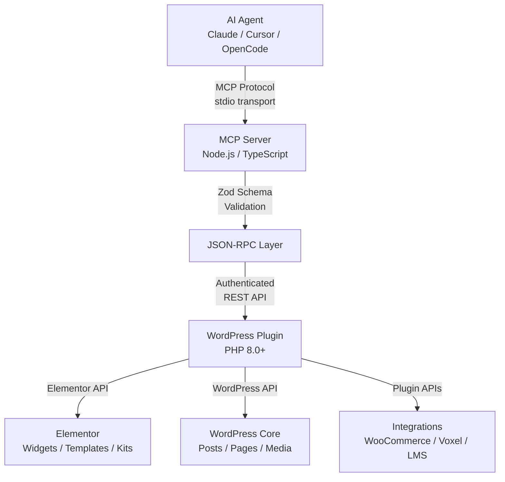

# Architecture

Elementeer is a layered system that connects AI agents to Elementor-powered WordPress sites through a structured chain of protocols, servers, and APIs. Every layer has a specific job and validates its inputs independently.

## System Layers

### Layer 1: AI Agent

The agent (Claude, Cursor, OpenCode, Antigravity, Codex CLI) communicates via the **Model Context Protocol** over stdio transport. Agents send structured JSON-RPC requests and receive typed responses. No direct HTTP or database access — all operations go through the MCP server.

### Layer 2: MCP Server (Node.js / TypeScript)

The `@elementeer/mcp` npm package is the protocol translator. It:

- Parses MCP tool invocations from the agent
- Validates all inputs using Zod schemas — every parameter is type-checked before it reaches WordPress
- Authenticates requests with API keys
- Translates tool calls into REST API requests
- Formats responses back into MCP-compatible structures

The MCP server is stateless. It maintains no persistent connection to WordPress — each tool invocation is an independent REST API call.

### Layer 3: REST API (PHP)

The Elementeer WordPress plugin exposes a structured REST API under the `/wp-json/elementeer/v1/` namespace. Every endpoint:

- Validates the API key against the capability system
- Enforces governance tier rules (L0–L3) before executing operations
- Runs in the WordPress context with full access to Elementor's internal APIs
- Returns typed, documented responses

### Layer 4: WordPress & Elementor

The plugin operates within the WordPress environment, using Elementor's PHP API for template operations, kit management, global styles, and widget manipulation. Integration addons (WooCommerce, Voxel, LMS systems) extend this layer with domain-specific endpoints.

## Key Architectural Properties

### Validation at Every Boundary

Inputs are validated three times:
1. **Zod schemas** in the MCP server catch type errors before any network call
2. **Capability checks** in the REST API ensure the API key is authorized
3. **Governance rules** (L0–L3) determine whether an operation executes immediately or requires approval

### Stateless Design

The MCP server holds no session state. Every request is independent. This means:
- No connection pools to manage
- No sticky sessions required
- Horizontal scaling is trivial
- MCP server restarts don't affect running operations

### Two-Layer Authentication

1. **API Key Authentication:** The MCP server presents a WordPress API key with every request. Keys are scoped to specific capabilities — a key that can list templates may not be able to delete them.
2. **Governance Authorization:** Even with a valid key, operations at L2 and L3 trigger approval workflows. The site owner controls which operations can execute automatically and which require human review.

## Tool Distribution

| Tier | Tools | Scope |
|------|-------|-------|
| **Free** | 128+ | Template CRUD, site assessment, global styles, SEO, navigation, media, brand setup, creator mode, theme builder, performance |
| **Advanced** | 170+ | WooCommerce, AI translation, Amelia booking, Snapshots, Design tokens, Change queue, Critical CSS |
| **Studio** (future) | 250+ | Multi-site orchestration, Control plane, Batch operations, Custom policy engine |

The Free tier covers all 8 integration families: Elementor core, WordPress CRUD, Template management, Media operations, SEO tooling, Navigation management, Performance tuning, and Accessibility.

## The MCP Protocol

Elementeer uses the [Model Context Protocol](https://modelcontextprotocol.io) — an open protocol standardizing how AI agents interact with external tools and data sources. The protocol defines:

- **Tool listing:** Agents discover available tools at connection time
- **Tool invocation:** Agents call tools with typed parameters and get typed responses
- **Tool schemas:** Every tool has a JSON Schema definition that agents use to construct valid invocations

This means any MCP-compatible agent can use Elementeer without custom integration code. The protocol handles discovery, validation, and response formatting.
